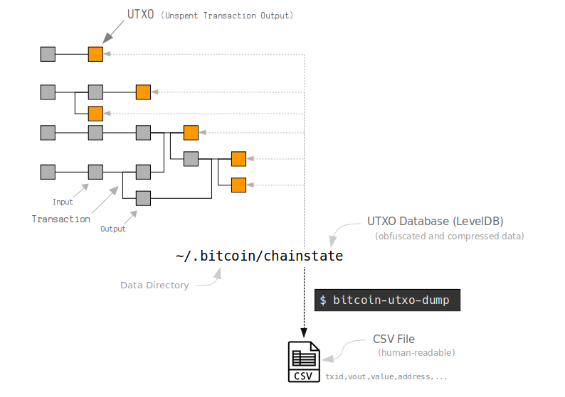

# Bitcoin UTXO Dump


Get a **list of every unspent bitcoin** in the blockchain.

The program iterates over each entry in Bitcoin Core's `chainstate` [LevelDB](http://leveldb.org/) database. It decompresses and decodes the data, and produces a human-readable text dump of all the [UTXO](http://learnmeabitcoin.com/glossary/utxo)s (unspent transaction outputs).

### Example CSV Results:

```
count,txid,vout,amount,type,address
1,033e83e3204b0cc28724e147f6fd140529b2537249f9c61c9de9972750030000,0,65279,p2pkh,1KaPHfvVWNZADup3Yc26SfVdkTDvvHySVX
2,e1c9467a885a156e56a29d9c854e65674d581ad75611b02290454b4862060000,1,9466355,p2pkh,1LpCmEejWLNfZigApMPwUY9nZTS8NTJCNS
3,a1f28c43f1f3d4821d0db42707737ea90616613099234f905dfc6ae2b4060000,1,339500,p2pkh,1FuphZ7xVPGrxthQT1S8X7nNQNByYxAT3V
4,818f5b9e3ede69da765d4c24684e813057c9b1f059e098661369b0a2ee060000,0,300000,p2pkh,18Y9yhjU9g2jjJmvaUy7TmUNZH9iPzQ4dd
5,d2f5e439152d076593a145581f8d76ea2e48ed155285b9a245cd42dd06070000,0,100000,p2pkh,1EKHTvovYWHfUJ6i9vsoidyTPQauCPH1qC
6,ea0c69fbd2389556b01771948ffc0507cf303bdc5a1b91b31acf9ecf6a070000,1,27668,p2pkh,1fkEhLpPKdmKtaxKdp4yDp1c87dF7GDub
7,05eafead65250a24b1592f8a006cbeab16a7b17ed2616507c5e0bd67bd070000,1,32000,p2pkh,15KmfJcGNfL29vpsSJ37uPzTQfr8Qe17Gq
8,2c0c985d384160d8c50c438bc67e639fe6047a7f2bac00a1238ca6a6d3070000,0,41936,p2pkh,17up1oPxBMTfZdehzy4v81KzLRHGDNX8ff
9,8261170b7ae26be70bd9e8f0e4bf19ce3571bb6464cdf9e478c471d372080000,1,4528208,p2pkh,1P6Ae7unrSjtx9J5SjWuwAdZBoWcbcjzBZ
...
```

## Install

First of all, you need to have a full copy of the blockchain. You also need to install LevelDB:

```
sudo apt install bitcoind
sudo apt install libleveldb-dev
```

After that, if you have [Go](https://golang.org/) installed you can do:

```
go get github.com/in3rsha/bitcoin-utxo-dump
```

This will create a binary called `bitcoin-utxo-dump`, which you can call from the command line:

```
$ bitcoin-utxo-dump
```

This will start dumping all of the UTXO database to a file called `utxodump.csv`.

**NOTE:** This program reads the chainstate LevelDB database created by `bitcoind`, so you will need to download and sync `bitcoind` for this script to work. In other words, this script reads your own local copy of the blockchain.

**NOTE:** LevelDB wasn't designed to be accessed by multiple programs at the same time, so make sure `bitcoind` isn't running before you start (`bitcoin-cli stop` should do it).


## Usage

The basic command is:

```
$ bitcoin-utxo-dump
```

You can view the results in the terminal with the `-v` (verbose) flag:

```
$ bitcoin-utxo-dump -v
```

The results will be written to the file `utxodump.csv` in the current directory (where you're running the program from). You can choose your own filename with the `-o` option:

```
$ bitcoin-utxo-dump -o ~/Desktop/utxodump.txt
```

If you know that the `chainstate` leveldb folder is in a different location to default (or you want to get a UTXO dump of the Testnet blockchain), use the `-db` option:

```
$ bitcoin-utxo-dump.go -db ~/.bitcoin/testnet3/chainstate/
```

You can select what data the script outputs from the chainstate database with the `-f` (fields) option. This is useful if you know what data you need and want to keep the results file small.

```
$ bitcoin-utxo-dump.go -f count,txid,vout,address
$ bitcoin-utxo-dump.go -f count,txid,vout,height,coinbase,amount,script,type,address # all possible fields
```

* **count** - The count of the number of UTXOs in the database.
* **txid** - Transaction ID for the output.
* **vout** - The index number of the output in a transaction (which output in the transaction it is).
* **height** - The height of the block the transaction was mined in.
* **coinbase** - Whether the output is from a coinbase transaction (i.e. claiming a block reward).
* **amount** - The amount of the output in _satoshis_.
* **script** - The locking script placed on the output (this is just the public key or hash160 for P2PK, P2PKH, and P2SH)
* **type** - The type of locking script (e.g. P2PK, P2PKH, P2SH, P2MS, P2WPKH, P2WSH, non-standard)
* **address** - The address the output is locked to (this is generally just the locking script in a shorter format with user-friendly characters).


All other options can be found with `-h`:

```
$ bitcoin-utxo-dump -h
```

## FAQ

### How long does this script take to run?

It takes me about **20 minutes** to get all the UTXOs.

Obviously this depends on how big the UTXO database is and how fast your computer is. For me, the UTXO database had 52 million entries, and I'm using a Thinkpad X220 (with a SSD).

Either way, I'd probably make a cup of tea after it starts running.

### How big is the file?

The file should be around **7GB**.

Again, this depends on how many entries are in the UTXO database, but it also depends what _fields_ you choose to have in the results:

```
$ bitcoin-utxo-dump.go -f address # small file
$ bitcoin-utxo-dump.go -f count,txid,vout,amount,type,address # bigger file
$ bitcoin-utxo-dump.go -f count,txid,vout,height,coinbase,amount,nsize,script,type,address # biggest file
```

### What versions of bitcoin does this tool work with?

This tool works for Bitcoin Core [0.15.1](https://bitcoincore.org/en/releases/0.15.1/) and above. You can check your version with `bitcoind --version`.

Older versions of bitcoind have a different chainstate leveldb structure. The structure was updated in 0.15.1 to make reading from the database more memory-efficient. Here's an interesting talk by [Chris Jeffrey](https://youtu.be/0WCaoGiAOHE?t=8936) that explains how you could crash Bitcoin Core with the old chainstate database structure.

Nonetheless, if you really want to parse an old-style chainstate database, try one of the _similar tools_ at the bottom of this page.

### How does this program work?

This program just iterates through all the entries in the LevelDB database at `~/.bitcoin/chainstate`.

However, the data inside `~/.bitcoin/chainstate` has been obfuscated (to prevent triggering anti-virus software) and compressed (to reduce the size on disk), so it's far from being human-readable. This script just deobfuscates each entry and decodes/decompresses the data to get human-readable data for each UTXO in the database.



### Can I parse the chainstate LevelDB myself?

Sure. Most programming languages seem to have libraries for reading a LevelDB database.

* [Go](https://github.com/syndtr/goleveldb)
* [Ruby](https://github.com/wmorgan/leveldb-ruby)
* [Python](https://github.com/wbolster/plyvel)

The trickier part is decoding the data for each UTXO in the database:

```
       type                          txid (little-endian)                      index (varint)
           \                               |                                  /
           <><--------------------------------------------------------------><>
    key:   430000155b9869d56c66d9e86e3c01de38e3892a42b99949fe109ac034fff6583900

    value: 71a9e87d62de25953e189f706bcf59263f15de1bf6c893bda9b045 <- obfuscated
           b12dcefd8f872536b12dcefd8f872536b12dcefd8f872536b12dce <- extended obfuscateKey
           c0842680ed5900a38f35518de4487c108e3810e6794fb68b189d8b <- deobfuscated (XOR)
           <----><----><><-------------------------------------->
            /      |    \                   |
       varint   varint   varint          script <- P2PKH/P2SH hash160, P2PK public key, or complete script
          |        |     nSize
          |        |
          |     amount (compressesed)
          |
          |
   11101000000111110110
   <-----------------> \
          height        coinbase
```

## Thanks

 * This script was inspired by the [bitcoin_tools](https://github.com/sr-gi/bitcoin_tools) repo made by [Sergi Delgado Segura](https://github.com/sr-gi). I wanted to see if I could get a faster dump of the UTXO database by writing the program in Go, as well as get the **addresses** for each of the UTXOs. The decoding and decompressing code in his repo helped me to write this tool.

### Similar Tools

 * [github.com/sr-gi/bitcoin_tools](https://github.com/sr-gi/bitcoin_tools)
 * [github.com/mycroft/chainstate](https://github.com/mycroft/chainstate)
 * [laanwj (unfinished)](https://github.com/bitcoin/bitcoin/pull/7759)

### Links

 * <https://github.com/syndtr/goleveldb>
 * <https://github.com/bitcoin/bitcoin/blob/master/src/compressor.cpp>
 * <https://bitcoin.stackexchange.com/questions/51387/how-does-bitcoin-read-from-write-to-leveldb/52167#52167>
 * <https://bitcoin.stackexchange.com/questions/52257/chainstate-leveldb-corruption-after-reading-from-the-database>
 * <https://bitcoin.stackexchange.com/questions/85710/does-the-chainstate-leveldb-only-contain-addresses-for-p2pkh-and-p2sh>
 * <https://github.com/bitcoin/bitcoin/issues/14584>
